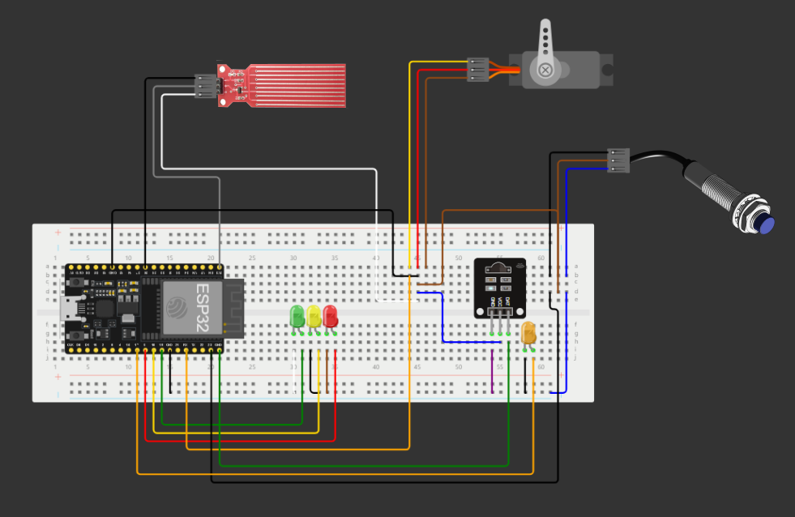

# TailWag: IoT Pet Care System
TailWag combines innovative hardware components with web-based monitoring and control, providing pet owners with peace of mind and ensuring their furry friends are happy and healthy.

## Description

TailWag is an IoT (Internet of Things) project that integrates a range of functionalities to cater to your pet's needs:

- **Treat Dispenser:** Controlled remotely by the owner through a web interface, the treat dispenser releases treats when the pet is detected in front of the device. This feature allows owners to interact with their pets even when they're away from home.
- **Water Level Tracker:** Equipped with a water level sensor, TailWag monitors the water level in the pet's water bowl. This ensures that your pet always has access to fresh water, even when you're not there to refill the bowl.
- **Sound Monitoring System:** TailWag includes a sound sensor to monitor sound levels at home. By tracking sound activity, the system can alert owners if their pet appears to be distressed or if there are any unusual noises in the environment.

All of these features are accessible through a user-friendly website, where pet owners can check on their pets, dispense treats, and view important information such as water level and sound status.

## Components Used

- NodeMCU (ESP8266)
- Infrared proximity sensor (E18-D80NK)
- Servo motor (SG90)
- Sound sensor (LM393)
- Water level sensor (Depth detection)
- Extra components: breadboard, LEDs, wires

## Connection Diagram

## How to Use

To set up and use TailWag:

1. Set up the Arduino IDE and add the provided code.
2. Adjust the proximity and sound sensor sensitivity to your requirements by tweaking the relevant parameters in the code.
3. Change the Wi-Fi network SSID and password in the code to match your network credentials.
4. Install the necessary drivers for your system for the NodeMCU.
5. Connect the components according to the provided connection diagram.
6. Deploy the code to the NodeMCU.
7. Access the website by navigating to the IP address provided in the serial monitor of the Arduino IDE.

## Website Preview

## Acknowledgments

This project was created to provide pet owners with a convenient solution to care for their pets remotely.

Feel free to explore the code and hardware setup, and provide feedback or suggestions!
